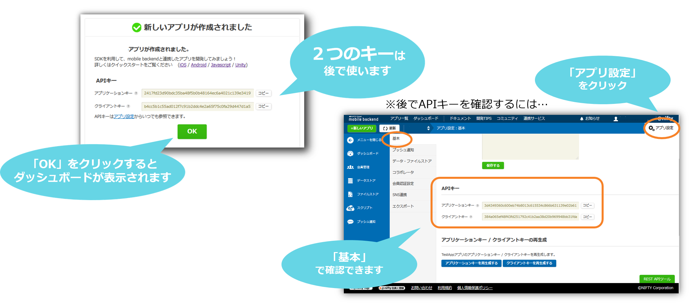

# 位置情報プッシュ通知でO2Oアプリを作ってみよう
*作成日：2020/03/03（更新日：2020/05/27）*


## 概要
* このチュートリアルでは、アプリ利用者が設定された領域に来るとプッシュ通知を行う
Location Notificationの仕組みを利用します。
（Location Notification機能はiOS8から追加された機能です。）
* 位置情報のデータ保存とサーバーからのプッシュ通知配信にニフクラ mobile backendを利用します。
* Location Notificationと組み合わせることで、セール情報などタイムリーなお知らせを動的に更新できる仕組みを作ります。
* 特定のエリアにいるアプリ利用者にだけその近辺のセール情報を通知するようなO2Oアプリを実際に作成していきます。
* アプリの主な動作フロー
    * エミュレーターで実行
        * 1. セール情報の更新を行うためにSilent Push通知を配信 
        * 2. Silent Push通知の内容からセールを実施する店舗を取得
    * 実機で実行
        * 3. セールのお知らせを行うLocation Notificationを設定　


## ニフクラmobile backendとは
スマートフォンアプリのバックエンド機能（プッシュ通知・データストア・会員管理・ファイルストア・SNS連携・位置情報検索・スクリプト）が**開発不要**、しかも基本**無料**(注1)で使えるクラウドサービス！

<center></center>

注1：詳しくは[こちら](https://mbaas.nifcloud.com/function.htm)をご覧ください

<div style="page-break-before:always"></div>

## 準備
### 動作確認環境
* ニフクラmobile backend 会員登録
  * 下記リンクより登録（無料）をお願いします<br>https://mbaas.nifcloud.com/
* Mac OS Mojave 10.14.4
* Xcode ver.11.3.1
* iPhone OS ver. 13.2.2

## 作業の手順
### 0.プッシュ通知機能を使うための準備
__[【iOS】プッシュ通知の受信に必要な証明書の作り方(開発用)](https://github.com/NIFCLOUD-mbaas/iOS_Certificate)__
* 上記のドキュメントをご覧の上、必要な証明書類の作成をお願いします
 * 証明書の作成には[Apple Developer Program](https://developer.apple.com/account/)の登録（有料）が必要です


### 1.ニフクラ mobile backendの設定
* [ニフクラ mobile backend](https://console.mbaas.nifcloud.com)にログインしてアプリを作成


* 以下のアプリ作成完了画面が表示されればOKです 


* この２種類のAPIキー（アプリケーションキーとクライアントキー）はXcodeで作成するiOSアプリにニフクラ mobile backendを紐付けるために使用します


* プッシュ通知の許可と 「手順 0. プッシュ通知機能を使うための準備」で作成したAPNsの証明書(p12形式)のアップロードを行う
* 証明書の取得方法は[mBaaSとAPNsの連携に必要な設定](https://mbaas.nifcloud.com/doc/current/tutorial/push_setup_ios.html)をご覧ください


### 2.店舗情報の準備
* データストアにLocationという名前のクラスを作成
* Locationクラスにnameとgeoフィールドを追加
* 新しいレコードを追加して店舗を登録
    * name: ニフクラ、geo: 35.696174,139.68951
*  **geoフィールドは入力形式を緯度経度に変更してください**


* このとき登録したデータのobjectIDは後程使用しますので、別途コピーしておいてください

### 3.Xcodeプロジェクトをダウンロード

* プロジェクトをダウンロード(またはgit clone)</br>
https://github.com/NIFCLOUD-mbaas/O2ODemo

* プロジェクトにあらかじめ実施していることは以下の通りです。
    * ニフクラ mobile backendのSDKをインストール済み
    * CapabilitiesのBackground ModesでLocation Updateを有効化
    * NotificationManagerクラスを作成
    * ストーリーボードでテスト用のボタンを作成
* ダウンロードしたフォルダを開き、「__O2ODemo.xcworkspace__」をダブルクリックしてXcode開きます(白い方です)


* 「O2ODemo.xcodeproj」（青い方）ではないので注意してください！


### 4.Location Notificationの再設定を行う

* 以下のようにUserNotificationsを利用できるように準備します。
    * Xcode上でプロジェクト設定画面を開き、Build Phasesを選択し、Link Binary With LibrariesにUserNotifications.frameworkを追加します。
 

### 5.Xcodeでのプッシュ通知設定
* CapabilitiesのBackground ModesでRemote Notificationsを有効にする
</br>(サンプルプロジェクトでは設定済み)

### 6. Xcodeでの位置情報の利用許可画面に表示する使用目的を書く
* Supporting FilesディレクトリにあるInfo.plistを開く
* NSLocationWhenInUseUsageDescriptionキーに位置情報の使用目的を書く
    * 使用目的を書かないと位置情報許可画面が表示されません


### 7.ニフクラ mobile backend SDKの初期化

* AppDelegate.mを開く
    * applications:didFinishLaunchingWithOptions:メソッドにあるSDKの初期化部分で、APIキーを書き換えてください。
    (APIキーは、ニフクラ mobile backendの管理画面から「アプリ設定->基本」を開くことで確認できます。)


### 8. ボタンを押した時のアクションを指定

* ViewController.mを開く
    * updateLocationNotification:メソッドにあるLOCATION_IDをデータストアに登録したデータのobjectIdに書き換える

### 9. アプリを実行してみましょう!
* エミュレータでの実行方法と、実機での実行方法の2つのやり方があります。
 * エミュレーターで実行方法
        * Silent Push通知の内容からセールを実施する店舗を取得
    * 実機で実行方法
        * セールのお知らせを行うLocation Notificationを設定　

#### 9.1 エミュレータでの実行(デモ)        
* 以下の手順でアプリを実行してください。
    * iOSシミュレーターでアプリを実行(Xcode左上の実行ボタンをクリック)

    

    * 起動したアプリのtestボタンをタップする
    (Local Notificationが設定される)
    * ホーム画面を表示させる
    * シミュレータの位置情報を変更
        * City Runに変更
    
    
    
    * Custom Locationに変更
    
    
        
    * LOCATION_IDに設定した店舗の位置情報を設定 </br>
    (City RunからCustom Locationに変更しないと通知が行われません)    
    
    

    * プッシュ通知が表示される

    

#### 9.2 実機での実行(実践)
* お店の場所(Pushを表示したい場所)の緯度と経度を検索する (1)
* [店舗情報の準備](https://github.com/vfa-trucldt/O2ODemo/tree/Feature_create_sample_app#2.店舗情報の準備)を参考に(1)の緯度と経度を新しいレコードとして追加します。
* [ボタンを押した時のアクションを指定](https://github.com/vfa-trucldt/O2ODemo/tree/Feature_create_sample_app#8ボタンを押した時のアクションを指定)を参考にLocation IDを(1)で作成したobjectIdに変更します。
* デバッグ用の実機でアプリを一度起動させて、deviceTokenを登録
    * データストアのinstallationクラスにデータが登録されたか確認
* ニフクラ mobile backendの管理画面からプッシュ通知を配信
 </br> 

* JSONに{"locationId":"LOCATION_ID"}を設定</br>(LOCATION_IDはLocationクラスの任意のobjectId)
    * タイトル、メッセージは空白
    * iOS向けに配信
    * 音声ファイル名のdefaultは削除
    * content-availableを有効にする
    * 端末がSilent Push通知を受信した時に、Location Notificationを再設定します。その地域に近づくと通知が表示されます。

## 解説
### 位置情報に基づく通知の配信
* 位置情報の検索と、Location Notificationの設定部分を実装していきます
    * 以下の図の2、3番の部分


### CLLocationManagerクラスのプロパティを作成
* NotificatonManager.mを開く
* @interface NotificationManager()の中に、プロパティを追加

```objective-c
@interface NotificationManager()

//CLLocationManagerクラスのプロパティを作成
@property (nonatomic, strong) CLLocationManager *mLocationManager;

@end
```

### initメソッドのオーバーライド

* NotificationManager.mのinitメソッドに以下の処理を追加
    * NotificationManagerが初期化された時に位置情報の許可画面を表示する

```objective-c
@implementation NotificationManager

-(instancetype)init{

    //CLLocationManagerのインスタンスを作成
    self = [super init];
    self.mLocationManager = [[CLLocationManager alloc] init];
    self.mLocationManager.delegate = self;

    //位置情報を使用する許可画面を表示
    [self.mLocationManager requestWhenInUseAuthorization];

    return self;
}

```

### 店舗情報を取得する処理を実装（その1)
* NotificationManager.mのsearchLocations:block:メソッドを実装
    * 指定されたlocationIdの店舗情報(位置情報など)をクラウドから取得

```objective-c
- (void)searchLocations:(NSString*)locationId block:(void (^)(NSError *error))blk{

    //LocationクラスのNCMBObjectを作成    
    NCMBObject *location = [NCMBObject objectWithClassName:@"Location"];

    //店舗情報のIDを設定
    location.objectId = locationId;

    //設定されたIDをもとにクラウドからデータを取得
    [location fetchInBackgroundWithBlock:^(NSError *localError) {
        if (localError){
            blk(localError);
        } else {

            //このあとここに処理を書いていきます
        }
    }];
}
```

- NCMBObject: データストアのデータを扱うためのクラス
 - objectWithClassName:メソッドで、どこからデータを取得するか指定しています
- objectId: データストアのデータを識別するためのID
- fetchInBackgroundWithBlock:メソッド: 設定されたobjectIdのデータを取得します

### 店舗情報を取得する処理を実装（その2)
* 店舗情報が取得できたあとの処理としてLocation Notificationの再設定を行うupdateLocation:block:を呼び出します。

```objective-c
//Locationクラスのgeoキーに設定されている位置情報を取得
NCMBGeoPoint *point = [location objectForKey:@"geo"];
[self updateLocation:point block:^(NSError *error) {
    if (error){
        blk(error);
    } else {
        blk(nil);
    }
}];
```

- NCMBGeoPoint: データストアで位置情報を簡単に利用するためのクラス
 - 本来データストアでは位置情報を以下のフォーマットで扱っています

```objective-c
{
    "__type":"GeoPoint",
    "longitude":<経度>,
    "latitude":<緯度>
}
```

### Location Notificationの再設定を行う
* Location Notification設定方法はiOS 10未満とiOS 10以上の場合で異なりますが、両場合を考慮した実装方法を説明していきます。

* Location Notificationを設定したいファイルに以下のコードを追加します。

```objective-c
#import <UserNotifications/UserNotifications.h>

//iOS 10以上フラグ
#define OS_10_0_0_OR_NEWER [[NSProcessInfo processInfo] isOperatingSystemAtLeastVersion:(NSOperatingSystemVersion){10, 0, 0}]
```

* NotificatonManager.mのupdateLocation:block:メソッドを実装

* 最初は、以前に登録されたNotificationを全てキャンセルします。
(セールが複数箇所で行われる場合には必要ありません)

```objective-c
//以前に登録されたNotificationをキャンセル
if (OS_10_0_0_OR_NEWER){
    [[UNUserNotificationCenter currentNotificationCenter] removeAllDeliveredNotifications];
    [[UNUserNotificationCenter currentNotificationCenter] removeAllPendingNotificationRequests];
} else {
    [[UIApplication sharedApplication] cancelAllLocalNotifications];
}
```

* NotificatonManager.mのupdateLocation:block:メソッドを実装

* 再設定するためのNotificationを作成します。

```objective-c
//再設定用のNotificationを作成する
if (OS_10_0_0_OR_NEWER){
    UNMutableNotificationContent *content = [UNMutableNotificationContent new];
    content.body = [NSString stringWithFormat:@"近くでセール開催中！"];
    content.sound = [UNNotificationSound defaultSound];
    content.badge = [NSNumber numberWithInteger:1];
} else {
    UILocalNotification *localNotif = [[UILocalNotification alloc] init];
    if (localNotif == nil)
        return;
    localNotif.alertBody = [NSString stringWithFormat:@"近くでセール開催中！"];
    localNotif.soundName = UILocalNotificationDefaultSoundName;
    localNotif.applicationIconBadgeNumber = 1;
}

```

* NotificatonManager.mのupdateLocation:block:メソッドを実装

CLCircularRegionの変数を用意し、
引数の位置情報からCLLocationCoordinate2Dを作成します。

このCLLocationCoordinate2Dをregionに設定し、
そのregionをNotificationに設定するとLocation Notificationが行われます。

```objective-c
//CLCircularRegionの変数を用意
CLCircularRegion *region = nil;

//regionに設定するCLLocationCoordinate2Dを作成
CLLocationCoordinate2D location = CLLocationCoordinate2DMake(geoPoint.latitude,
                                                             geoPoint.longitude);
```


* NotificatonManager.mのupdateLocation:block:メソッドを実装

リージョンを作成して、リージョンから外に出た場合の通知をOFFにします。

```objective-c
//リージョン作成(中心点、そこからの半径、regionの識別子を設定)
region = [[CLCircularRegion alloc] initWithCenter:location
                                           radius:50.0
                                       identifier:@"salePoint"];

//リージョンから外に出た場合には通知が行われないようにNOを設定
region.notifyOnExit = NO;
```

* NotificatonManager.mのupdateLocation:block:メソッドを実装
* リージョンを設定してLocation Notificationを登録します。

```objective-c
//リージョンを設定してLocation Notificationを登録
if (OS_10_0_0_OR_NEWER){
    UNLocationNotificationTrigger *trigger = [UNLocationNotificationTrigger triggerWithRegion:region repeats:NO];
    UNNotificationRequest *request = [UNNotificationRequest requestWithIdentifier:@"NotificationIdentifier" content:content trigger:trigger];

    UNUserNotificationCenter *center = [UNUserNotificationCenter currentNotificationCenter];
    [UNAuthorizationOptions options = UNAuthorizationOptionAlert + UNAuthorizationOptionSound + UNAuthorizationOptionAlert;
 [center requestAuthorizationWithOptions:options
                  completionHandler:^(BOOL granted, NSError * _Nullable error) {
            if (!error) {
                NSLog(@"request authorization succeeded!");
            } else {
                NSLog(@"request authorization fail!");
            }
        }];
    [center addNotificationRequest:request withCompletionHandler:^(NSError * _Nullable error) {
        if (!error) {
            NSLog(@"Local Notification succeeded");
        }
        else {
            NSLog(@"Local Notification failed");
        }
    }];
} else {
    localNotif.region = region;
    localNotif.regionTriggersOnce = YES;
    [[UIApplication sharedApplication] scheduleLocalNotification:localNotif];
}
```

### NotificationManagerをViewControllerに用意する

* ViewController.mを開き、viewDidLoadメソッド内でstatic変数にNotificationManagerのインスタンスを代入してください。
(NotificatonManagerクラスのインポートとstatic変数の宣言は実装済みです。)

```objective-c
- (void)viewDidLoad {
    [super viewDidLoad];

    //static変数にNotificationManagerのインスタンスを代入
    manager = [[NotificationManager alloc] init];
}

```

### ボタンを押した時のアクションを指定

* ViewController.mのupdateLocationNotification:を実装
    * ボタンのアクションで店舗情報の取得メソッドを呼び出すようにする
    * LOCATION_IDをデータストアに登録したデータのobjectIdに書き換える

```objective-c
- (IBAction)updateLocationNotification:(id)sender {

    //NotificatonManagerの店舗情報取得メソッドを呼び出す
    [manager searchLocations:@"LOCATION_ID" block:^(NSError *error) {
        if (error){
            NSLog(@"error:%@",error);
        }
    }];

}
```

### プッシュ通知の許可画面を表示させる

* AppDelegate.mを開く
* ニフクラ mobile backendの初期化処理のあとに追加

```objective-c
- (BOOL)application:(UIApplication *)application
    didFinishLaunchingWithOptions:(NSDictionary *)launchOptions
{
    //APIキーの設定
    [NCMB setApplicationKey:@"YOUR_APPLICATION_KEY" clientKey:@"YOUR_CLIENT_KEY"];

    //プッシュ通知の許可画面を表示させる
    UIUserNotificationType types = UIUserNotificationTypeBadge |
                                   UIUserNotificationTypeSound |
                                   UIUserNotificationTypeAlert;
    UIUserNotificationSettings *mySettings =
    [UIUserNotificationSettings settingsForTypes:types categories:nil];
    [[UIApplication sharedApplication] registerUserNotificationSettings:mySettings];


    return YES;
}
```

### deviceTokenの要求
* AppDelegate.mを開く
* プッシュ通知許可画面表示の下に追加

```objective-c
UIUserNotificationType types = UIUserNotificationTypeBadge |
                               UIUserNotificationTypeSound |
                               UIUserNotificationTypeAlert;
UIUserNotificationSettings *mySettings =
[UIUserNotificationSettings settingsForTypes:types categories:nil];
[[UIApplication sharedApplication] registerUserNotificationSettings:mySettings];

//リモートプッシュ通知を受信するためのdeviceTokenを要求
[[UIApplication sharedApplication] registerForRemoteNotifications];
```

### Silent Push通知との組み合わせ
* Silent Push通知を受信するための実装を行っていきます。
    * 以下の図の1番の部分


### このあとのデバッグについて

* このあとのデバッグでは、以下の用意が必要です。
* デバッグ用の実機
    * シミュレータではSilent Push通知を受信できません
* プッシュ通知の証明書
* また、Location Notificationの仕様として、すでにリージョン内にいる端末に対しては通知されません。
(すでにお店の中にいる人にセールのお知らせがきてしまうことになりかねない)
* つまり実機でプッシュ通知が表示されるところまで確認するためには、設定したリージョンまで移動しなければなりません。


### NotificationManagerをAppDelegateに用意する
* static変数にインスタンスを代入するようにapplication:didFinishLaunchingWithOptions:を変更
    * (static変数の宣言とNotificationManagerクラスのインポートは実施済み)

```objective-c

    //リモートプッシュ通知を受信するためのdeviceTokenを要求
    [[UIApplication sharedApplication] registerForRemoteNotifications];

    //application:didFinishLaunchingWithOptions:のreturn文前に追加
    manager = [[NotificationManager alloc] init];

    return YES;
}
```

### deviceTokenをクラウドに登録する
* AppDelegate.mに以下のデリゲートメソッドを追加
    * デバイストークンがAPNsから発行された時に呼び出されます

```objective-c
-(void)application:(UIApplication *)application
    didRegisterForRemoteNotificationsWithDeviceToken:(NSData *)deviceToken
{
    //NCMBInstallation作成
    NCMBInstallation *installation = [NCMBInstallation currentInstallation];

    //デバイストークンをセット
    [installation setDeviceTokenFromData:deviceToken];

    //ニフクラ mobile  backendのデータストアに登録
    [installation saveInBackgroundWithBlock:^(NSError *error) {
        if(!error){
            //端末情報の登録が成功した場合の処理
        } else {
            //端末情報の登録が失敗した場合の処理
        }
    }];
}
```

* NCMBInstallation: 端末情報を管理するためのクラス
* setDeviceTokenFromData:メソッド: デバイストークンをセットするメソッド
* saveInBackgroundWithBlock: NCMBInstallationをデータストアに登録するメソッド

### プッシュ通知受信時の処理を実装
* AppDelegate.mに以下のデリゲートメソッドを追加
* サーバーから配信されたプッシュ通知を受信した時に呼び出されます

```objective-c
- (void)application:(UIApplication *)application
    didReceiveRemoteNotification:(NSDictionary *)userInfo
    fetchCompletionHandler:(void (^)(UIBackgroundFetchResult))completionHandler
{
    //ペイロードからセール店舗のIDを取得
    NSString *locationId = nil;
    locationId = [userInfo objectForKey:@"locationId"];

    if (locationId){
        //Locaton Notificationの設定
        [manager searchLocations:locationId block:^(NSError *error) {
            if (error){
                NSLog(@"error:%@",error);
            }
            completionHandler(UIBackgroundFetchResultNewData);
        }];
    }

}
```


## まとめ
* 今回のハンズオンで行ったアプリ開発以外の作業は
    * ニフクラ mobile backendへのログイン
    * データの用意
    * プッシュ通知の証明書設定
だけでした。
* ニフクラ mobile backendを利用することで、サーバー環境の用意にかかっていた工数が削減されアプリ開発に集中することができます。
